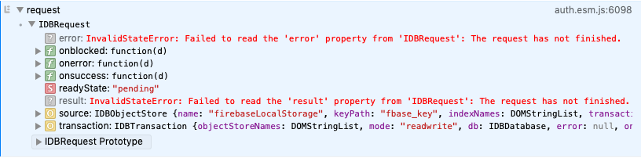

# iphone auth tabs bug

This repository, available live at [iphone-tabs-auth-bug.firebaseapp.com](http://iphone-tabs-auth-bug.firebaseapp.com), contains the minimal code required to demonstrate a critical auth-related bug that appears in mobile safari with multiple tabs. The bug prevents *all* authentication methods from working, including sign out and sign in.

Live test auth details:

**email:** test@example.com
**pass:** test1234

## Steps to reproduce

1. Copy your firebase settings into `config.ts`
2. Ensure you already have a registered user available for that project
3. Load [iphone-tabs-auth-bug.firebaseapp.com](http://iphone-tabs-auth-bug.firebaseapp.com) on mobile safari
4. Log in
5. Open a number of new tabs with the above URL. While the app will often display the email of the logged in user, if you open enough tabs you'll find that `onAuthStateChange()` never outputs anything, and the screen stays like this forever.


6. After this occurs once, any new tabs will have the same issue, and refreshing the page does not fix the issue. *All authentication methods stop working*.


## Tested on:

iphone X, ios 12.3.1
iphone 6s, ios 12.3.1, 12.4.1


## A critical bug

While this simple reproduction can sometimes take 10-20 tabs to show the issue, on a larger production app I've found it occurs frequently on the second or third tab. This is a *huge* issue, as having two tabs open is something that frequently happens during the register flow:

1. Somebody signs up within the app
2. They get a verification email
3. They click the link, opening a new tab
4. Any auth methods in the new tab now return promises that never resolve
5. The user gives up and never comes back, because why would you pay for an app which breaks during the register flow

I've tried everything as a workaround when this happens, but nothing seems to resolve it other than closing all the affected tabs. I've tried:

- unsubscribing from `onAuthStateChange()` and calling it again
- calling auth.delete() and recreating it
- programmtically deleting the firebase indexeddb
- combinations of the above


## What's happening

The underlying issue is that the first `set()` call on the indexed db instance is hanging. The db's open request completes successfully, but the first `set()` request stays in `pending` state indefinitely:



To reproduce this:

1. use Safari's dev tools to load the page from an iphone enough times to appear just like the above screenshot
2. log the request received by the [`onIDBRequest_()` function](https://github.com/firebase/firebase-js-sdk/blob/master/packages/auth/src/storage/indexeddb.js#L393) in packages/auth/src/storage/indexeddb.js
3. you'll see that the request in the console stays pending indefinitely

As to why this is happening -- I have no idea. Modifying the [`set()`](https://github.com/firebase/firebase-js-sdk/blob/master/packages/auth/src/storage/indexeddb.js#L425) method from this:

```js
var objectStore = self.getDataObjectStore_(
    self.getTransaction_(dbTemp, true));
```

to this:

```js
var objectStore = db.createObjectStore(this.objectStoreName_);
```

Prevents the hang, but also generally results in each new tab requiring the user to login (although it does seem to enable persistence while reloading the same tab).